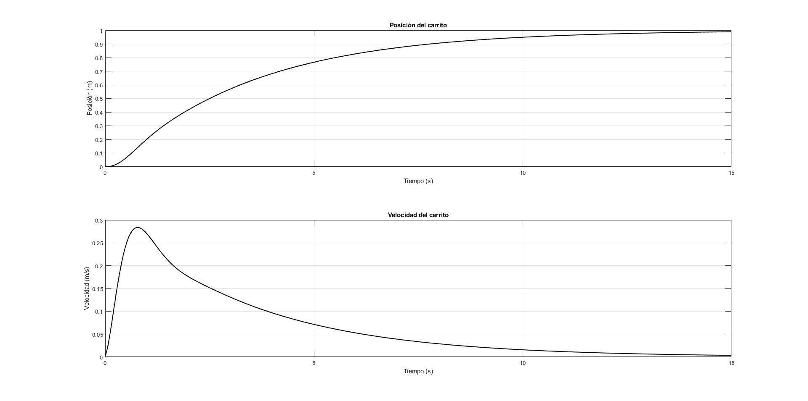
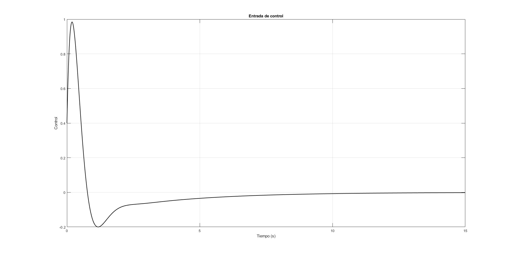
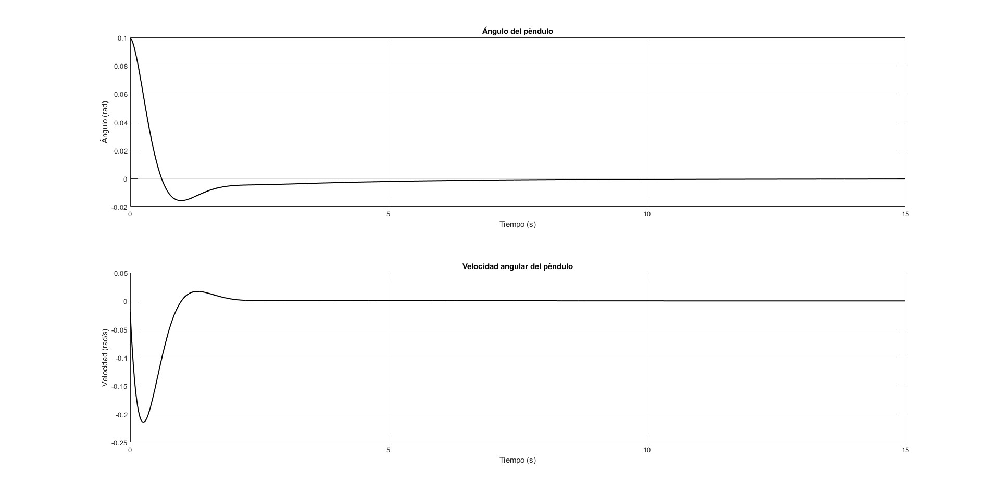
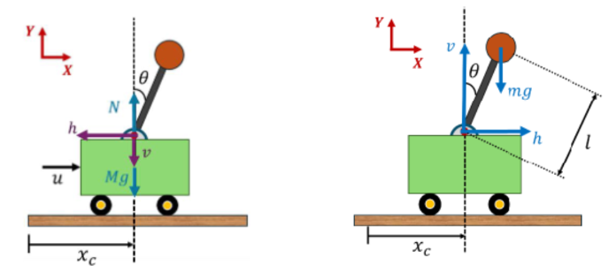
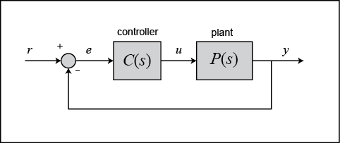
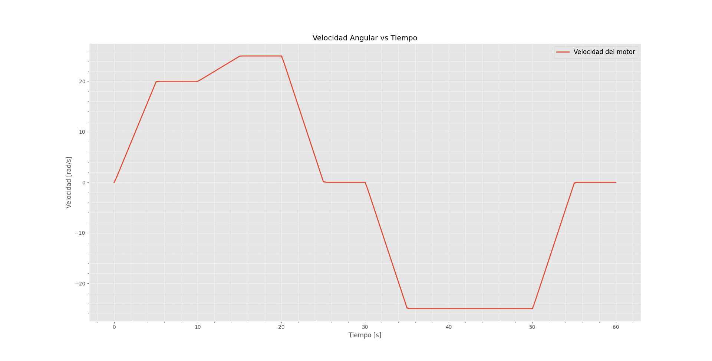
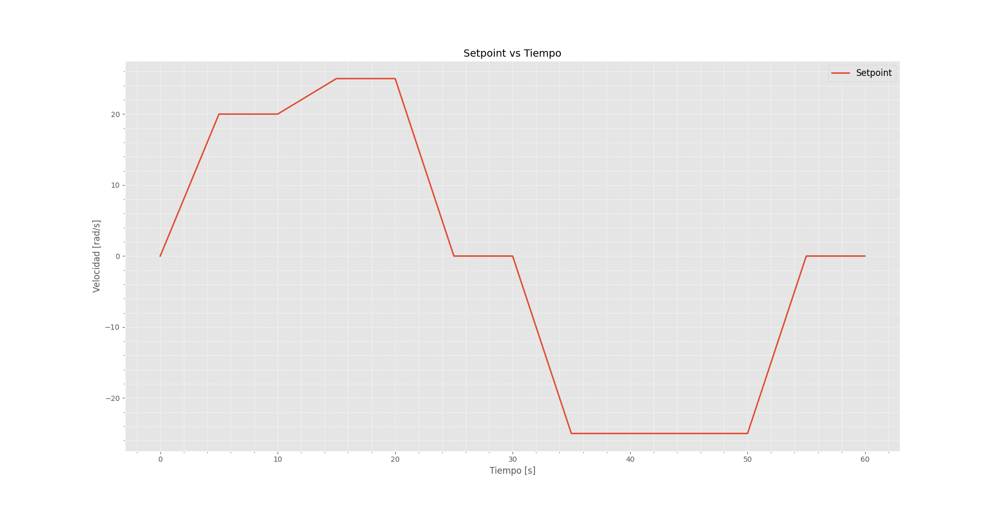
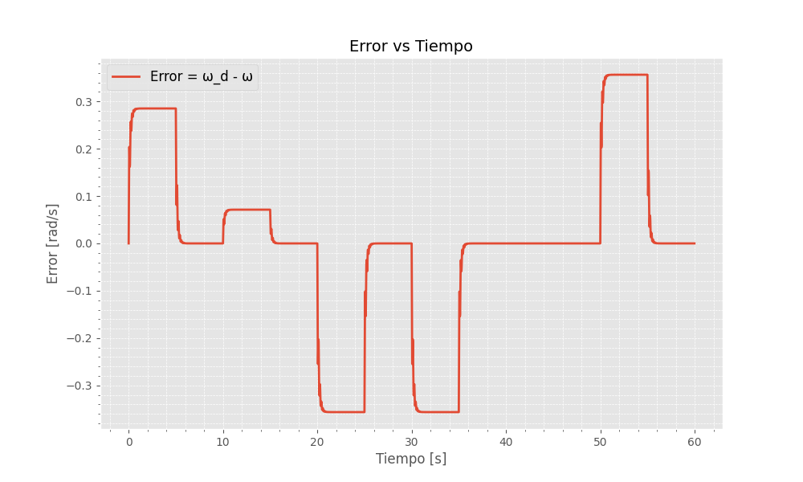

# Dynamic systems simulations

##### Simulations for various control systems using MATLAB and Python.

## Overview
This repository contains three simulation projects focused on robotic control systems, utilizing various control methodologies including PID controllers and dynamic modeling. Each project includes detailed simulations and analysis of robotic systems.

## Projects included

### Inverted Pendulum Control

- Simulation of an inverted pendulum attached to a movable cart.
- Goal: Maintain pendulum stability while moving the cart from point A to point B.
- Controller: Implemented a PD control strategy.
- Technologies Used: MATLAB
- Mathematical modeling using Newton-Euler equations.
- PD controller tuning through iterative adjustments.
- Analysis of stability and dynamic response.

### Two Degrees of Freedom (2-DOF) Manipulator

- Dynamic control of a robotic manipulator with two rotational joints.
- Goal: Control angular position and velocity of two linked arms.
- Controller: Two independent PID controllers tuned heuristically.
- Technologies Used: MATLAB
- Dynamic modeling with Euler-Lagrange equations.
- PID controller for each joint to reach setpoints [0.8 rad, 0.5 rad].
- Visualization of angular position, velocity, and control input over time.

### DC Motor Speed Control

- PID control implementation for regulating the angular speed of a DC motor.
- Goal: Achieve precise speed control following a trapezoidal reference input.
- Controller: PID controller designed with feedback linearization technique.
- Technologies Used: Python
- Modeling motor dynamics through differential equations (Kirchhoff and Newton-Euler).
- PID control tuned to manage voltage input effectively.
- Analysis and visualization of angular speed, control voltage, current, and torque.

## Gallery

### Cart - Pendulum

### 2 DoF manipulator

### DC Motor

